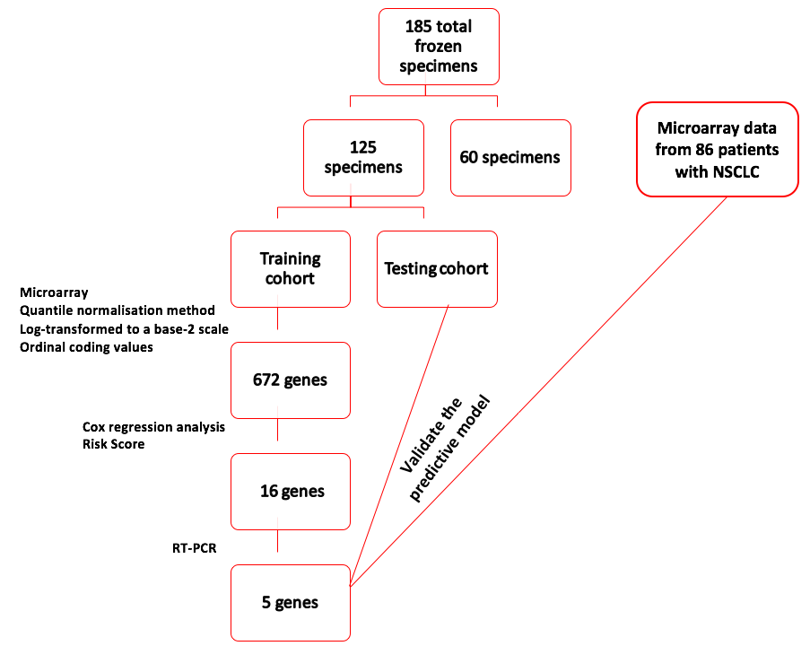

```{r setup, include=FALSE}
knitr::opts_chunk$set(echo = TRUE, cache = TRUE, message = FALSE)
library("GEOquery")
library("survival")
library("survminer")
library("RColorBrewer")
library(rpart)
library(rpart.plot)
library(genefilter)
library(cvTools)
library(class)
library (dplyr)
library(sparsediscrim)
library(NMF)
gsm <- getGEO("GSE4882", GSEMatrix = TRUE)
gse <- getGEO("GSE4882", GSEMatrix = FALSE)
gsms <- GSMList(gse)
gpl <- GPLList(gse)
```

#Introduction
An estimated 12741 new individuals are to be diagnosed with lung cancer in 2018, the majority of which will be non-small cell lung cancer (Australian Institute of Health and Welfare,2018). Current prognostic markers are inadequate for predicting the outcome of these patients. A paper by the New England Journal of Medicine used microarray and real-time reverse-transcriptase polymerase chain reaction (RTPCR) on 185 specimens, analysed 672 genes to procure a biomarker based on 5 genes (Five-Gene Signature in Non-Small-Cell Lung Cancer, 2007). This report summarises the methods and findings of the paper, and attempts to reproduce the analysis whilst providing critique. 
</br>
</br>
<center></center>

#Summary of the paper

##Aim
Identify genes that are linked with non-small-cell Lung Cancer to create a biomarker that predicts high/low risk patients.

##Methods
* Patients and Tissue specimens 
185 frozen specimens of lung cancer tissue were randomly assigned for microarray and RT-PCR analysis. Gene expression of 125 randomly selected patients with NSCLC was used to construct the predictive model. The predictive model was validated with 60 randomly selected patients.

* Microarray analysis of complementary DNA  
A previous study identified the association between 672 genes and invasive activity of lung cancer. Microarray was conducted on the 672 genes to obtain expression levels.

* RT-PCR Analysis  
RT-PCR was performed on 16 genes to validate the results obtained using microarray analysis. The transcripts were amplified with reagent and a sequence detection system. Gene expression was quantified with the use of sequence detector software.

##Experimental design and workflow  
A total of 185 specimens were used and randomly divided to validation cohort of 60 specimens and experimental cohort of 125 specimens.  The experimental cohort was randomly assigned to training set or testing set. The average intensity for each gene in the microarray analysis was rescaled by quantile normalisation method and log-transformed to a base-2 scale to reduce variations and allow gene expressions to be compared between PCR and microarray. Genes with coefficients of variation less than 3% was removed to reduce noise. Gene expression intensity values were transformed to ordinal coding values.
Expression levels were quantised into levels 1 to 4 based on percentiles 0~25, 25~50, 50~75, 75~100 respectively. 
Univariate Cox regression were used to determine which genes were linked with death in terms of hazard ratio. Protective genes had a ratio less than 1 and risk genes greater than 1. Univariate Cox proportional-hazards regression analysis was used to evaluate the significance of gene expression obtained from microarray analysis and the survival of NSCLC patients. For genes with great significance, the gene- expression coding values and the corresponding regression coefficients was used to calculate risk score for each patient.
<br/>
Risk score = sum (gene expression level x regression coefficients) 
<br/>


_16- Gene signature_
<br/>
The 16 genes with the most correlation to NSCLC was selected using Univariate Cox regression and the risk scores for these genes were calculated. Patients were classified to high-risk or low-risk using the median risk score of 4.9 as the threshold value. It was stated that by having an equal number patients in the high risk and low risk groups, the effect of having extreme values in the training cohort would be eliminated. The risk scores and threshold value obtained were applied to the testing cohort. 
<br/>

_5- gene signature_
<br/>
Five genes significantly associated with survival were further selected from the 16 genes to construct a decision tree based on gene expression obtained from RT-PCR. The decision tree was also used to classify patients as high risk or low risk, and the tree was pruned using minimum error to avoid overfitting.
The estimation of overall survival and relapse-free survival was analysed using Kaplan-Meier method. Log-rank test was used to determine differences in survival between high risk and low risk group.
Multivariate Cox proportional hazards regression analysis with stepwise selection was used to assess survival and the five gene signature with prognostic factors such as age, sex, tumour size.  The five-gene risk prediction model was validated on the testing cohort consisting of 60 randomly selected patients. Univariate cox regression analysis was conducted to identify genes that correlated with overall survival or recurrence. Hazard ratios from the regression were used to assign risk and protective genes with ratios >1 signalling risk, and ratios <1 signalling protection. Univariate cox proportional hazard regression analysis
was used to evaluate the association between survival and level of gene expression, and a linear equation was constructed using the 16 genes significantly correlated with survival.


##Results
* _16 gene signature and survival_  
Univariate regression was performed on the 16 genes and using hazard ratio, 4 protective genes and 12 risk genes were identified. Patients with high risk expressed risk genes whereas those with low risk expressed protective genes. High risk patients had lower median overall survival rate and lower median relapse-free survival compared to low risk. This result was also observed in the testing and training cohort.
<br/>

* _5 gene signature and survival_  
Using the results obtained from microarray and and RT-PCR, 5 genes (DUSP6, MMD, STAT1, ERBB3, LCK) were selected based on having the great correlation.
Using decision tree-analysis and RT-PCR, 59 patients were classified as high risk and 42 patients as low risk. The five gene signature had an overall accuracy of 96%. According to Cox multivariate regression analysis, the high risk five-gene signature in tumor stage III and older age were significantly associated with death and recurrence of cancer. Additionally, patients with stage I/II cancer with high risk genes had shorter survival and relapse free survival compared to patients with low risk genes. 
<br/>

* _Validation of the five gene signature_ 
<br/>
The validation cohort of 60 patients include 34 with high risk and 26  with low risk. Patients with high risk had shorter overall survival than those with low risk. Multivariate Cox proportional analysis showed that the five gene signature was highly associated with overall survival.
Five gene signature was also validated with microarray data of 86 patients from Western population with NSCLC . Again, Cox multivariate regression analysis showed evidence that high-risk five genes and tumor stage III were significantly associated with death. 
<br/>

* _Conclusion_
<br/>
The decision tree model was effective in predicting patient outcome in the paper's cohort. The researchers claimed that it would be useful in drug trials for ordering patients according to risk.

#Critique and reproduction of paper

## Critique/Appropriateness of the methods and analysis

* _Microarrays_
<br/>
Microarrays enable a large number of gene expressions to be measured, and thus is appropriate for this study to measure the expression levels of 672 genes. 
<br/>

* _RT- PCR_ 
<br/>
RT-PCR was used to detect and measure gene expression and to validate the level of expression of genes found on microarray analysis. RT-PCR uses a small number of genes to capture the relevant covariate structure. This method was appropriate for determining the 5 most significant genes to create the decision tree.
<br/>

* _Normalisation and quantising expression into discrete levels_
<br/>
Normalisation reduces variation due to different microarray experiments by rescaling the intensity values for samples in each microarray. This makes the expression results more comparable to each other. The expressions were quantised into factors 1:4 based on percentiles, however we did not do this for most of our analysis, because we felt like it was removing too much information. We did incorporate this quantisation method later in "Replicating their graphs" to be more faithful to the original. 
<br/>

* _Univariate Cox regression_
<br/>
Cox univariate proportional hazards and regression analysis was used to investigate the relationship between gene expression and survival outcome of patients with NSCLC. The P value for each gene reveals if its expression is significant in determining patient survival. The smaller the P value the more significant the gene. The most significantly associated genes were selected for the 16 gene signature. 
Advantages: Better than logistic regression because it accounts for truncated follow-up times which are due to the end of the study rather than death. (Babiska et al., 2015)
Disadvantages: The methods nor supplementary methods discuss testing for assumptions, and because we don't have the Alive/Dead data, we are unable to test it ourselves. Thus, we do not know if their regression is valid or not. 
<br/>

* _Multivariate Cox regression_
<br/>
This method evaluates independent prognostic factors associated with survival and the five-gene signature including age, sex, tumour stage, and histologic characteristics. This method appropriately identifies the prognostic factors most influential on survival. 
Advantages and disadvantages of multivariate cox regression are largely similar with the univariate. We were unable to replicate multivariate analysis in their paper because of the lack of data. 
<br/>

* _Decision tree_  <br/>
Decision tree is a tree-like model of listing different genes as internal node and shows the probability of survival for patients with NSCLC by looking at the risk scores. Pruning was used to reduce the size of decision trees by removing sections that have little to no significant power in classifying the NSCLC cases. This reduces the potential for the model to overfit. Overall, the model is simple to understand and can clearly show the outcome for each scenario. However, even after pruning, decision trees can still be prone to overfitting. This is especially noticeable because the genes that were chosen that had very homogenous expression levels across risk: see ERBB3, DUSP6, MMD (Figure 4). Risk increases from left to right, and the expression levels for those genes are very homogenous. The problem  is compounded by their sub-optimal threshold for low/high risk, for which their decision tree aims to predict. A better threshold would be further to the right, as there is obviously a subpopulation of patients there with very different gene expression. 
<br/>

##Creating our biomarker
We first pre-treated the data and created a fake death variable (faux_death) based on metastasis time. TRUE = Dead whilst FALSE = Alive in this case. 
<br/>
```{r}
pdata <- pData(gsm[[1]])
expd <- exprs(gsm[[1]])
expd <- gsm[[1]]@assayData$exprs
nobg_expd <- pmax(expd, 3000)
logged_expd <- log2(nobg_expd)
cov <- vector("numeric")
for (i in 1:672) {
    cov[i] <- 100*(sd(logged_expd[i,])/mean(logged_expd[i,]))
}
cov3_true<-cov>3
#485 genes, logged and removed COV<3 (and corrected for background). Just need to quantilise the entire df/matrix now. 
#ID as col name, gene as rows
logged_expd[!cov3_true,] <- NA
rownames(logged_expd) <- gpl$GPL3730@dataTable@table$Symbol
#Missing gene symbol is relevant to biomarker. Manually add in.
rownames(logged_expd)[469] <- "ZNF264"
#rownames_logged_expd <- rownames(logged_expd)
temporary <- logged_expd[complete.cases(logged_expd), ]
logged_expd3 <- temporary
rownames(logged_expd3) <- rownames(temporary)
# logged_expd3[] = ceiling(rank(logged_expd3)/length(logged_expd3)*4)
#logged_expd3 is 485 genes quantised 1:4, paper doesnt say why (in methods or supp methods)
risk_genes = c("NF1", "HGF", "HMMR", "IRF4", "ZNF264", "ERBB3",
               "STAT2", "CPEB4", "RNF4", "DUSP6", "MMD",
               "DLG2", "ANXA5", "LCK", "FRAP1", "STAT1")
in_risk_list <- rownames(logged_expd3) %in% risk_genes
#1:4 levels of expression, df with ZNF264 label in correct 
rownames(logged_expd3)[in_risk_list]
new_tdfn <- t(logged_expd3[in_risk_list,])
x <- c()
 for (i in 1:125) {
    x[i] <- paste('id', i, collapse="", sep="_")
}
rownames(new_tdfn) <- x
new_tdfn <- cbind(new_tdfn, pdata[,40:45])
colnames(new_tdfn)[17:22] <- c("Age", "Stage", "Cell_type", "Gender","Met", "Survival")
new_tdfn <- as.data.frame(new_tdfn)
new_tdfn[,c(1:17, 21:22)] <- sapply(new_tdfn[,c(1:17, 21:22)], as.numeric)

coeffs <- c(0.52, -0.84, -1.09, 0.52, 0.59, 0.55, 0.47, 1.32, 0.51, 0.59, 0.55, 0.92, 0.65, -0.77, -0.58, 0.75)
new_tdfn$risk <- rowSums(mapply('*', new_tdfn[,1:16], coeffs))
new_tdfn[,1:16]<- new_tdfn[,c(3 ,14 , 13, 4, 7, 6, 1, 12, 2, 8, 5, 11, 9, 15, 16, 10)]
#use y to sort whenever needed
y <- c("NF1", "HGF", "HMMR", "IRF4", "ZNF264", "ERBB3",
               "STAT2", "CPEB4", "RNF4", "DUSP6", "MMD",
               "DLG2", "ANXA5", "LCK", "FRAP1", "STAT1")
#creating faux_death
metastasis <- as.numeric(pdata$`Survival time (month):ch1`)-as.numeric(pdata$`Metastasis time (month):ch1`)
new_tdfn$faux_death <- metastasis>.028
table(new_tdfn$faux_death)
```
Some of the methods for their selection of genes was unclear (not elucidated in the supplementary methods) and so we conducted rowttests instead. 
```{r} 
testing<- logged_expd3[!duplicated(rownames(logged_expd3)),]
Tstatistics = rowttests(testing,as.factor(new_tdfn$faux_death), tstatOnly = TRUE)
head(Tstatistics)
best100T <- order(abs(Tstatistics[, "statistic"]), decreasing = TRUE)[1:100]
testing <- testing[best100T, ]
dim(testing)
boxplot(logged_expd3["FRAP1",] ~ new_tdfn$faux_death)
```
<br/>
For classifier and cross validation please refer to the bottom of the page.  

##Difficulties and Sucesses in reproducing their results
* Difficulties  
The data sets that were provided have missing gene symbols, including one gene they used in their 16 gene biomarker. To overcome this, we used Find Tool on Gene Name to locate the gene card for ZNF264. After manuallying inserting the gene card, we were able to replicate the analysis and graphs from the paper.  
However, the biggest problem we faced in reproducing their result was the missing Alive/Death data. This resulted in us having to create our own fake Alive/Death data set based on metastasis hence, why our results are different to paper. 

* Successes  
Regardless of the difficulties we faced, we successfully "replicated" their survival curves, however due to having different Alive/Death data, our result were not completely the similar. The heatmap based on their 16 gene biomarker was re-created. However, we had different colour scheme most likely due to different colouring software and threshold values being used in the paper. Nevertheless, the trend still exists in our heatmap. We reproduced the decision based on our own death/alive dataset hence its different to the one shown in the paper. Our reproduced analysis and graphs would have been the same if the Alive/death data set was given. 

##Replicating their graphs
The paper does not supply the survival status of patients. It is impossible to do the analysis to get their significant genes and regression coefficients. We will create a faux survival and then conduct analysis with the faux data. 
First we stratify expression into 4 levels (1:4) based on gene expression quartiles. 
```{r}
logged_expd3[] = ceiling(rank(logged_expd3)/length(logged_expd3)*4)
```

```{r, echo=FALSE}
#logged_expd3 is 485 genes quantised 1:4, paper doesnt say why (in methods or supp methods)
risk_genes = c("NF1", "HGF", "HMMR", "IRF4", "ZNF264", "ERBB3",
               "STAT2", "CPEB4", "RNF4", "DUSP6", "MMD",
               "DLG2", "ANXA5", "LCK", "FRAP1", "STAT1")
in_risk_list <- rownames(logged_expd3) %in% risk_genes
#1:4 levels of expression, df with ZNF264 label in correct 
rownames(logged_expd3)[in_risk_list]
new_tdfn <- t(logged_expd3[in_risk_list,])
x <- c()
 for (i in 1:125) {
    x[i] <- paste('id', i, collapse="", sep="_")
}
rownames(new_tdfn) <- x
new_tdfn <- cbind(new_tdfn, pdata[,40:45])
colnames(new_tdfn)[17:22] <- c("Age", "Stage", "Cell_type", "Gender","Met", "Survival")
new_tdfn <- as.data.frame(new_tdfn)
new_tdfn[,c(1:17, 21:22)] <- sapply(new_tdfn[,c(1:17, 21:22)], as.numeric)
```
Creating the 16 Gene Signature
Creating the df for all patients, containing some phenodata from gsms and the levels of expression of all 16 genes. 
```{r}
coeffs <- c(0.52, -0.84, -1.09, 0.52, 0.59, 0.55, 0.47, 1.32, 0.51, 0.59, 0.55, 0.92, 0.65, -0.77, -0.58, 0.75)
new_tdfn$risk <- rowSums(mapply('*', new_tdfn[,1:16], coeffs))
new_tdfn[,1:16]<- new_tdfn[,c(3 ,14 , 13, 4, 7, 6, 1, 12, 2, 8, 5, 11, 9, 15, 16, 10)]
#use y to sort whenever needed
y <- c("NF1", "HGF", "HMMR", "IRF4", "ZNF264", "ERBB3",
               "STAT2", "CPEB4", "RNF4", "DUSP6", "MMD",
               "DLG2", "ANXA5", "LCK", "FRAP1", "STAT1")
#creating faux_death
metastasis <- as.numeric(pdata$`Survival time (month):ch1`)-as.numeric(pdata$`Metastasis time (month):ch1`)
new_tdfn$faux_death <- metastasis>.028
```
Like in the paper, the IDs were split into 2 cohorts. 
```{r}
new_tdfn$ID<-1:125
cohort1_ID <- sample(x=1:nrow(new_tdfn),size = 0.5*nrow(new_tdfn))
cohort1 <- new_tdfn[new_tdfn$ID %in% cohort1_ID,]
cohort2 <- new_tdfn[!new_tdfn$ID %in% cohort1_ID,]
```

```{r}
#****cohort1****
cohort1$high_risk <- cohort1$risk>median(cohort1$risk)
tdfn.as.high_risk1 <- survfit(Surv(cohort1$Survival, cohort1$faux_death) ~ high_risk, data=cohort1)
surv1 <- ggsurvplot(tdfn.as.high_risk1,data = cohort1, xlab = "Months",ylab="Overall Survival",legend.labs=c("Low-risk","High-risk"),palette = c( "#2E9FDF","#FF0000"))
#****cohort2****
cohort2$high_risk <- cohort2$risk>median(cohort2$risk)
tdfn.as.high_risk2 <- survfit(Surv(cohort2$Survival, cohort2$faux_death) ~ high_risk, data=cohort2)
surv2 <- ggsurvplot(tdfn.as.high_risk2,data = cohort2, xlab = "Months",ylab="Overall Survival",legend.labs=c("Low-risk","High-risk"),palette = c( "#2E9FDF","#FF0000"))
splots <- list()
splots[[1]] <- surv1
splots[[2]] <- surv2
arrange_ggsurvplots(splots, print = TRUE,
  ncol = 2, nrow = 1, risk.table.height = 0.4)
```
<b/>
Figure 1:</b> Kaplan Meier plot of time until faux_death, separated based on *their* high and low risk cohorts.These plots are created based on the months spent alive. faux_death was used instead of true Alive/Dead data, as it was not provided.
```{r}
#****cohort1****
tdfn.as.NoRelapse.high_risk1 <- survfit(Surv(cohort1$Met, cohort1$faux_death) ~ high_risk, data=cohort1)
surv3 <- ggsurvplot(tdfn.as.NoRelapse.high_risk1,data = cohort1, xlab = "Months",ylab="%Relapse-free Survival",legend.labs=c("Low-risk","High-risk"),palette = c( "#2E9FDF","#FF0000"))
#****cohort2****
tdfn.as.NoRelapse.high_risk2 <- survfit(Surv(cohort2$Met, cohort2$faux_death) ~ high_risk, data=cohort2)
surv4 <- ggsurvplot(tdfn.as.NoRelapse.high_risk2,data = cohort2, xlab = "Months",ylab="%Relapse-free Surviva",legend.labs=c("Low-risk","High-risk"),palette = c( "#2E9FDF","#FF0000"))
splots2 <- list()
splots2[[1]] <- surv3
splots2[[2]] <- surv4
arrange_ggsurvplots(splots2, print = TRUE,
  ncol = 2, nrow = 1, risk.table.height = 0.4)
```
<br/>
<b>Figure 2:</b> Kaplan Meier plot of time until faux_death, separated based on *their* high and low risk cohorts.These plots are created based on the months spent alive. Faux_death was used instead of true Alive/Dead data, as it was not provided.

```{r}
par(mfrow=c(1,2))
hmcols<-colorRampPalette(c("blue","white","red"))(256)
#***cohort1***
ordered1 <- cohort1[order(cohort1$risk),]
actually_ordered1 <- ordered1[,y]
actually_ordered1_1=actually_ordered1[,1:ncol(actually_ordered1)]
h1 <- aheatmap(t(actually_ordered1_1), Colv = NA, Rowv = NA, scale="column", col=hmcols)
#***cohort2***
ordered2 <- cohort2[order(cohort2$risk),]
actually_ordered2 <- ordered2[,y]
actually_ordered2_1=actually_ordered2[,1:ncol(actually_ordered2)]
h2 <- aheatmap(t(actually_ordered2_1), Colv = NA, Rowv = NA, scale="column", col=hmcols)
#plot heatmaps in grid.
```
<b>Figure 3:</b> Heatmap of the gene expression levels quantised into levels 1:4. Patients (columns) are ranked by risk score, and thus risk score increases from left to right. Although the graphs look slightly different, the pattern looks roughly the same. It is likely that the expression levels were scaled differently. The paper did not specify what scale was used. Something of interest is that their 16 gene biomarker registers HMMR as a risk gene but it looks quite protective. 

```{r}
hmcols2<-colorRampPalette(c("blue","red"))(256)
newdf<- logged_expd[complete.cases(logged_expd), ]
newdf<-t(newdf)
x <- c()
for (i in 1:125) {
    x[i] <- paste('id', i, collapse="", sep="_")
}
rownames(newdf) <- x
in_risk_list <- colnames(newdf) %in% risk_genes
new_df2 <- newdf[,in_risk_list]
new_df2 <- new_df2[,y]
new_df2=new_df2[,ncol(new_df2):1]
overall_heatmap <- heatmap(t(as.matrix(new_df2[order(new_tdfn$risk),])), Colv = NA, Rowv = NA, scale="column", col=hmcols2)
overall_heatmap

```
<b>Figure 4:</b> Heatmap based on unquantised, logged expression levels. We constructed this heatmap because we believed that quantising expression into 4 discrete levels lost us a lot of information about the cohort. 

Decision tree using their specified 5 genes
```{r}
set.seed(1)
rtree_fit <- rpart(faux_death ~ DUSP6+ MMD+ STAT1+ERBB3+LCK, cohort2)
pfit<- prune(rtree_fit, cp=0.0125)
rpart.plot(pfit)
printcp(rtree_fit)
```
<b>Figure 5:</b> A decision tree was made using their selected 5 genes and faux_death. Differences are likely attributed to the lack of real Alive/Dead data. 

##Classifier and Cross validation
Classifiers are used to build a model to predict with. The model is cross validated by partitioning the data into a training and testing set. The training set forms the model whilst the testing set predicts and evaluates the model, providing information such as accuracy and error. The top 100 most differentially expressed genes will be used to form the model. Two classifiers will be used and compared (DLDA and knn). Both 2 and 10-fold cross validation will be conducted and compared with each other. Stratified 2 fold is selected to mirror the paper's own CV method (and this likely contributes to their absurdly high accuracy). Stratified 10 fold CV is selected because a study by Kohavi claims that 5 fold CV introduces variance due to the instability of the models, and recommends 10 fold CV even when more folds are possible (Kohavi, 1995). 

Build a classifier: DLDA with 2-fold CV
```{r}
set.seed(69)
classes <- as.factor(new_tdfn$faux_death)
folds <- cvFolds(ncol(testing), K = 2)$which
valuesSet1 = testing[, folds == 1]
valuesSet2 = testing[, folds == 2]
classesSet1 = classes[folds == 1]
classesSet2 = classes[folds == 2]
trainedSet1 = dlda(t(valuesSet1), classesSet1)
DLDApredictedSet2 = predict(trainedSet1, t(valuesSet2))[["class"]]
trainedSet2 = dlda(t(valuesSet2), classesSet2)
DLDApredictedSet1 = predict(trainedSet2 , t(valuesSet1))[["class"]]
allActual <- c(as.character(classesSet1), as.character(classesSet2))
DLDApredictAll <- c(as.character(DLDApredictedSet1), as.character(DLDApredictedSet2))
DLDAconfusion <- table(Actual = allActual, Predicted = DLDApredictAll)
DLDAconfusion
accuracy=sum(diag(DLDAconfusion))/sum(DLDAconfusion)
accuracy
errorrate=1 - sum(diag(DLDAconfusion))/sum(DLDAconfusion)
balancederrorrate=mean((rowSums(DLDAconfusion) - diag(DLDAconfusion))/rowSums(DLDAconfusion))
balancederrorrate
precision= DLDAconfusion["TRUE", "TRUE"]/sum(DLDAconfusion[, "TRUE"])
```
Comparing 2-fold with 10-fold CV
```{r}
set.seed(69)
#folds = cvFolds(#IDs, K = 10)
folds1 = cvFolds(ncol(testing), K = 10)
#
foldlist1 = split(folds1$subsets, folds1$which)
cvRes = cvTruth = c()
for (i in 1:10) {
    TSindex = foldlist1[[i]]
    #create dfs where gene is rowname, ID is colname
    LS = testing[,-TSindex]
    TS = testing[,TSindex]
    classLS <- as.factor(new_tdfn$faux_death)[-TSindex]
    #because ID is colname, need to t() the df
    trainedSet = dlda(t(LS), classLS)
    DLDApredictedSet2 <- predict(trainedSet, t(TS))[["class"]]
    cvTruth = c(cvTruth, as.factor(new_tdfn$faux_death)[TSindex])
    cvRes = c(cvRes, as.vector(DLDApredictedSet2))
}
cvRes
cM = table(cvRes, cvTruth)
print('Overall accuracy is: ')
val = sum(diag(cM)) / length(cvRes)
round(val,2)
print('Balanced error rate is: ')
val = (cM[2,1] / colSums(cM)[1]) + (cM[1,2] / colSums(cM)[2])
round(val,2)
#Comparison of DLDA 2fold vs 5fold
table(cvRes, DLDApredictAll)
```
From the final table, it is obvious that the 2-fold cv is completely dissimilar to the 5-fold cv. It is highly likely that the 2-fold cv is overfitting, and by a large margin when the two balanced error rates are compared.*Note: yes that is the error rate and not accuracy. This overfitting is likely what also happened in the paper's CV.
</br>
Build another classifier (knn):
```{r}
set.seed(69)
tdata <- t(testing)
valueSet1a <- tdata[folds == 1,]
valueSet2a <- tdata[folds == 2,]
#split the data
gclass <- as.factor(new_tdfn$faux_death)
classSet1a <- gclass[folds == 1]
classSet2a <- gclass[folds == 2]
cvRes = cvTruth = c()
cv.knn.predict1 = knn(train = valueSet1a, test = valueSet2a, cl = classSet1a, k = 2)
cv.knn.predict2 = knn(train = valueSet2a, test = valueSet1a, cl = classSet2a, k = 2)
allActuala <- c(as.character(classSet1a), as.character(classSet2a))
cv.knn.predict <- c(as.character(cv.knn.predict1), as.character(cv.knn.predict2))
cv.knn.confusion <- table(Actual = allActuala, Predicted = cv.knn.predict)
cv.knn.confusion
accuracy=sum(diag(cv.knn.confusion))/sum(cv.knn.confusion)
accuracy
balancederrorrate=mean((rowSums(cv.knn.confusion) - diag(cv.knn.confusion))/rowSums(cv.knn.confusion))
balancederrorrate
```
Comparing 2-fold with 10-fold.
```{r}
set.seed(69)
cvRes = cvTruth = c()
for (i in 1:10) {
    TSindex = foldlist1[[i]]
    LS = tdata[-TSindex,]
    TS = tdata[TSindex,]

    cv.knn = knn(train = LS, test = TS, cl = gclass[-TSindex], k = 10)
    cvTruth = c(cvTruth, gclass[TSindex])
    cvRes = c(cvRes, as.vector(cv.knn))
}
cvRes
## Confusion matrix
cM = table(cvRes, cvTruth)  
print('Overall accuracy is: ')
val = sum(diag(cM)) / length(cvRes)
round(val,2)
print('Balanced error rate is: ')
val = (cM[2,1] / colSums(cM)[1]) + (cM[1,2] / colSums(cM)[2])
round(val,2)
table(cvRes, cv.knn.predict)
```
Again, the 2 CV model was overfitting. 
</br>
It is possible that neither classifier is working well because the original 614 genes were selected based on invasive activity, and the 100 most differentially expressed genes in this study dont reflect well with time metastasised (the basis of faux_death). If so, a different sent of genes need to be microarrayed instead. 

#References: 
* Australian Institute of Health and Welfare. (2018). Lung cancer in Australia: an overview, Summary - Australian Institute of Health and Welfare. [online] Available at: https://www.aihw.gov.au/report/lung-cancer-in-australia-an-overview/contents/summary [Accessed 14 Jun. 2018].
* Babiska, M., Chudek, J., Chemecka, E., Janik, M., Klimek, K. and Owczarek, A. (2015). Limitations of Cox Proportional Hazards Analysis in Mortality Prediction of Patients with Acute Coronary Syndrome. Studies in Logic, Grammar and Rhetoric, 43(1).
* Five-Gene Signature in Non-Small-Cell Lung Cancer. (2007). New England Journal of Medicine, 356(15), pp.1581-1583.
* Kohavi, R., 1995, August. A study of cross-validation and bootstrap for accuracy estimation and model selection. In Ijcai (Vol. 14, No. 2, pp. 1137-1145).